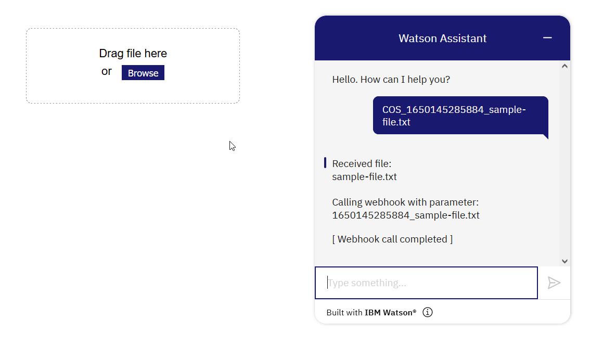

# IBM Watson Assistant: File Upload
IBM Watson Assistant has no built-in way to upload files in a chat. This sample shows you how to build an integration for that in a Node.js web app.

See: [Blog post](https://sarah-packowski.medium.com/watson-assistant-chatbot-file-upload-9579d17a4682)

